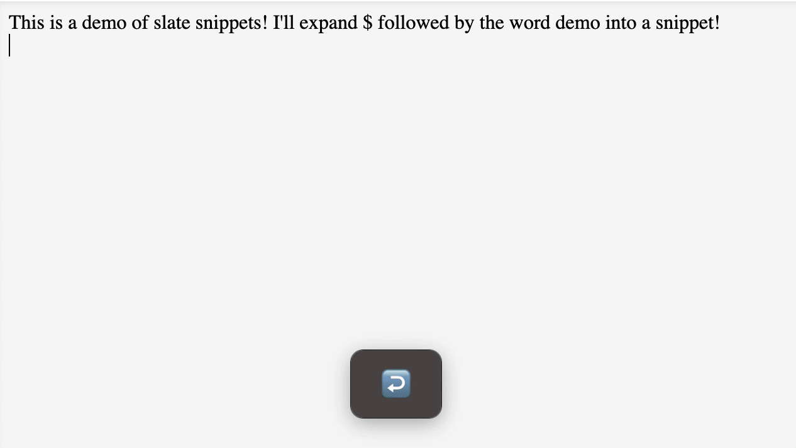

# Slate Snippets Extension

This slate extension uses [vscode's snippet parser](https://github.com/microsoft/vscode/blob/main/src/vs/editor/contrib/snippet/snippetParser.ts) to enable user defined snippets in slate.

Most features are supported out of the box including tab stops, variables, and variable resolution. Some features are not supported yet such as

- nested placeholders `${1:another ${2:placeholder}}`
- synced placeholders `${1:synced} ${1:synced}`
- choices `${1:one,two,three}`

Checkout the [demo](slate-snippets.netlify.app/) to see how the snippets work.
